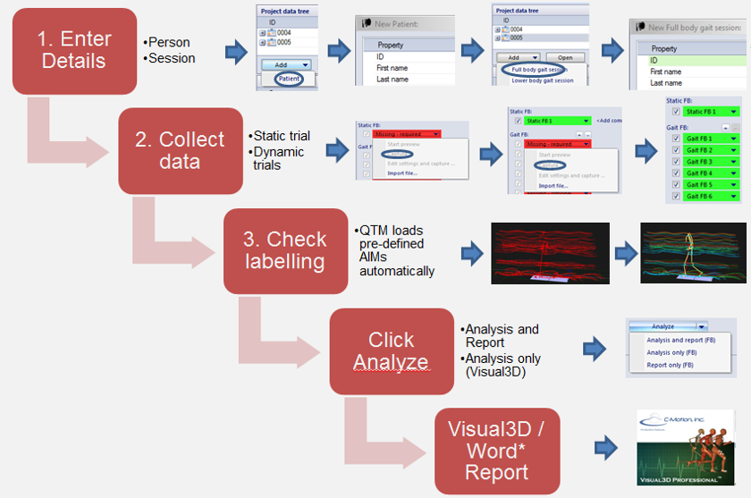
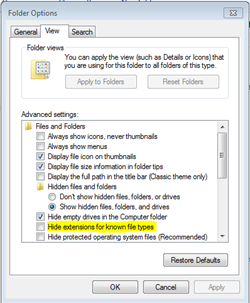
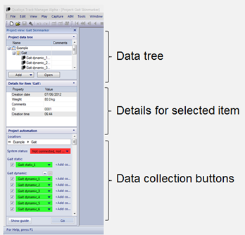
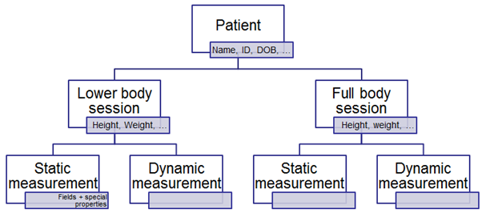
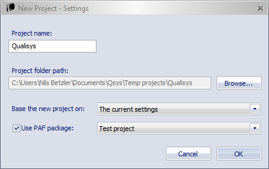

# Project Automation Framework
Documentation  
Version: 3.0.0  
QTM version: 2018.1  
Publication date: April 08, 2021

# Table of Contents
- [Project Automation Framework](#project-automation-framework)
- [Table of Contents](#table-of-contents)
- [Introduction](#introduction)
  - [Purpose and application of PAF](#purpose-and-application-of-paf)
  - [Folder structure and relevant files](#folder-structure-and-relevant-files)
  - [Preparation steps](#preparation-steps)
- [The Settings.paf file](#the-settingspaf-file)
  - [Purpose](#purpose)
  - [YAML](#yaml)
  - [File sections](#file-sections)
    - [Globals](#globals)
    - [Package Information](#package-information)
    - [Types](#types)
    - [Measurements](#measurements)
    - [Overview of analyses](#overview-of-analyses)
      - [External program](#external-program)
      - [Visual3D analysis](#visual3d-analysis)
      - [Report analysis](#report-analysis)
      - [Compound](#compound)
      - [Instantiate template](#instantiate-template)
    - [Fields](#fields)
    - [Columns](#columns)
  - [Default fields added by QTM](#default-fields-added-by-qtm)
- [Making a package available in QTM](#making-a-package-available-in-qtm)
- [Preparing Visual3D scripts for PAF](#preparing-visual3d-scripts-for-paf)
  - [Editing Pipeline scripts](#editing-pipeline-scripts)
  - [Basic recommendations and conventions](#basic-recommendations-and-conventions)
    - [Visual3D settings](#visual3d-settings)
    - [Virtual Lab](#virtual-lab)
    - [Directions](#directions)
    - [Bi-lateral analyses](#bi-lateral-analyses)
    - [Efficiency](#efficiency)
  - [PHP](#php)
- [Tutorial: creating a PAF package](#tutorial-creating-a-paf-package)

# Introduction
## Purpose and application of PAF
The purpose of the Project Automation Framework (PAF) is to streamline the  process from initial capture to final report. This saves time and ensures that data is collected in processed in a consistent way. The typical application is shown in the following figure. When Visual3D is used for all biomechanical calculations, it still maintains flexibility as events, models, report templates or any other component of the analysis can be modified within Visual3D when needed.



Qualisys provides various modules, for example for gait analysis or different sports. These are ready-to-use analysis packages, for more information see www.qualisys.com > Software > Project automation framework. If you are interested in one the packages or want to buy a license, please contact <sales@qualisys.com>.

In contrast to this, with the Open Project Automation Framework the users can build and modify their own PAF analysis package.

PAF features are available to all QTM users with a limitation of analysis types (see “Overview of analyses” on page 11) (> QTM 2.17). To activate all analysis types simply enter the PAF license key that you received from Qualisys, see QTM Help: Getting Started > System setup > Software installation > Enter plug-in license.

## Folder structure and relevant files
The basic folder structure of a PAF project is similar to a standard QTM project, however there are some additional files and folders:

| Name   | Type   | Purpose |
|--------|--------|---------|
| AIM models | Folder | Optional: If the project definitions, contains references to AIM models, these must be placed here. |
| Calibrations | Folder | Identical to standard QTM project. |
| Data | Folder | Required: QTM will save all data that is collected through the PAF interface here. |
| Messages | Folder | Identical to standard QTM project. |
| Settings | Folder | Optional: if the project definitions, contains references to settings files, these must be placed here. |
| Templates | Folder | Required[^2]: all files that are required to analyse the measure data is stored in this folder, e.g. scripts and report templates |
| Settings.paf | File  | Required: this is the core of the PAF project as it contains the definition of the data collection structure, analyses, etc. |
| Settings.qtmproj | File | Identical to standard QTM project, contains all camera and software settings.|  

[^2]: Required if the PAF project includes any type of analysis.

## Preparation steps
It is recommended to set up windows to show file extensions as some files can have the same name, but different extensions. This is done in Folder Options in Windows Explorer:



Further, a text editor such as [Notepad++](http://notepad-plus-plus.org/) is required to edit the settings files and scripts.

# The Settings.paf file
## Purpose
The settings.paf is the core of the PAF project. When loading a project, QTM will detect the presence of the settings.paf file when loading the project, read its contents and adapt the Project view accordingly. If the Project view is not shown, select View > Project view (Ctrl + R).



Note that the QTM reads in the settings.paf when loading the project. This means that QTM needs to be re-started and the project re-loaded for changes to the file to take effect.
If present, the settings.paf file controls the behavior of the QTM Project View. It serves two main purposes:
1. defining what types of objects will be present in the project and
2. what metadata they will contain as well as defining the session and analysis wizard operation.

## YAML
The PAF file is written and parsed according in the yaml standard. The parser used adheres to most of version 1.2 of the standard, which is documented at http://www.yaml.org. The relevant parts for understanding the PAF file are yaml sequences and maps. Sequences are most commonly entered as comma separated lists of elements:  
```
[Element 1, Element 2, Element N]
```  
Maps are defined as key/value-pairs, where both keys and values can be any kind of YAML node. The key is followed by a colon. PAF files have scalar nodes for keys, but values may be scalars, sequences or maps:  
```
    Key 1: Value 1  
    Key 2: Value 2  
    Key 3:  
        Nested key 1: Nested value 1   
        Nested key 2: Nested value 2   
    Key 4: Value 4
```  

YAML syntax includes line indenting. A nested map, for instance, ends where the indentation reverts to the previous level as shown above. This means that it is an advantage to edit PAF files in an editor that uses monospace fonts. It is important to note that tab characters are not allowed in indentation.

There are other ways of encoding both sequences and maps, for examples look at the YAML documentation.

Most parts of the PAF file are case sensitive.



Knowledge about the project type system is essential to understanding QTM project operation. QTM reads type definitions from the PAF file. These definitions can then be instantiated to PAF items. Each PAF item (except measurements) corresponds to a folder in the PAF folder hierarchy. The item data are stored in a file called data.qpr in each item folder. Measurement metadata are stored in a special compartment of the measurement (.qtm) files. The PAF items are organized in a tree structure corresponding to the directory structure in the data folder. This tree structure can also be seen in the Project view.

PAF type definitions are organized into classes. Classes are currently not used to any great extent, but good practice is to try and have one class of types on each level of the data tree. If, for instance, different kinds of patients may be the first level, then a class called Subject could be a good to keep track of that.

When type name references are required in the PAF file, two forms are applicable. Either a class name can be given, which will include all types of that class or a ClassName.TypeName form can be used to reference a single type only.

## File sections
The PAF file is of the YAML map form. Different keys denote the different sections of the file.

### Globals
Some settings are found directly at the global level of the PAF file:
-  **Project ID**: A human readable name that identifies the project. This name is recorded in data files and should not be changed once data collection has started as doing so will render data files useless.
- **Root type**: Reference to the class or type name to use at the highest level in the PAF item hierarchy.
- **Date format**: Specifies what date format to use in this project. Applies mainly to exports and column values but not to the field edit dialog. Accepted values are Iso, Little endian and Middle endian.
- **Date separator**: Specifies which token to use to separate the parts of the dates when formatting them. Accepted values are Dash, Slash, Dot and None.
- **Time format**: Specifies what time format to use in this project. Applies mainly to exports and column values but not to the field edit dialog. Accepted values are 12-hour and 24-hour.
- **Filename filter**: A regular expression that determines which files (in addition to the qtm files) that will be visible in the tree view.
- **Export c3d settings**. This section is optional and is used when exporting to c3d file.Possible properties of this section are: Point units: Possible units are: mm, cm or m.
- **Default fields**: A sequence of names of fields that will be added to all types. QTM also adds a number of default fields automatically. For a list of these, see the Default Fields section.

### Package Information
This section contains information that the package management system uses. It is used mainly when installing packages and when creating new projects based on a package.
```
    Package Information: 
        Name: Gait Skinmarker 
        Version: 0.9
    Required QTM version: 2.7
    Previous names: [Gait test, Gait]
```
The possible properties of this section are:
- **Name**: The name of the package. Show when creating a new project and used to keep the connection between a project and the package it was created from to, for instance, know if there is a new version of a package. This means that this value should not be changed unless strictly necessary because that will break the connection between existing projects and new versions of the package.
- **Version**: Two numbers separated by a period sign (e.g. 44.23), three numbers separated by period signs (e.g. 1.45.3214), or three numbers separated by a period sign and a build number separated by a plus sign (e.g. 1.3.0+188). The version of the package. Used to keep track of which version a project is based on. Visible in the about box when a project is open. Useful for debugging purposes and for knowing if the package can be upgraded.
- **Required QTM version**: Two or three digits separated by a period sign. The QTM version that is required for this package to work properly. Checked on install time. Must include major and minor version number and can optionally include build number too.
- **Previous names**: A sequence of names that this package has had earlier in development. This is used only when checking if a project should be upgraded and allows for packages to be renamed without losing the project upgrade path.

### Types
The structure of the types section is:
```
Types: 
    Class name 1: 
        Fields:
            Class field1: Value1 
            Class field2: Value2 
        Type name 1: 
            … 
        Type name 2: 
            … 
    Class name 2: 
        Another type name 
            … 
```
All class and type names have to be unique. Each class definition is a map that contains the type names as keys and the type definitions as values.

The class definition may also contain the special key named Fields. If this key is present it should contain a map or sequence that contains fields that should be defined for each type of this class. If the fields are given as a map they also specify default values for the fields. A type can override the default value of a field by including the field name as part of its own definition but it cannot undefine a field that has been defined in the class.

Each type definition is itself a map that can have the following properties:
- **Children**: A sequence of references to class or type names that can be created as children to items of this type. A type that has children cannot have measurements.
- **Measurements**: A sequence of measurement type names. If a type has the measurement property, it is considered to be a session-like type. It cannot have other children and it will have a wizard interface containing measurements (of the types specified by this parameter) and analyses.
- **Analyses**: A sequence of analysis names. These will be shown in the Analyze dropdown of the session wizard. The first analysis in the list will be the default analysis that is run when the button itself is clicked.
- **Fields**: A sequence of field names. These fields will be added to the definition and when an item is created they will get the default value from the field definition in the fields section of the file.
- **Display order**: A sequence of field names denoting the order in which to display the fields of items of this type. Inherited fields can also be entered. Fields named here will be displayed first in field lists. Fields that are not named are displayed afterwards in an arbitrary order.
- **Heading**: An optional string displayed instead of the type name as a heading for the measurement type in the wizard pane.
- **Any field name**: Naming any field as a key and a default value for that field in this type is also permitted. Any default value given here overrides the default value from the field specification. The default value should always be a scalar except for string fields that also support sequences. See documentation of the Default property in the Fields section for more information.

### Measurements
The structure of the measurement section is:
```
Measurements:
    Fields:
        Class field1: Value
    Measurement type name 1:
        …
    Measurement type name 2:
        …
```
The measurements are defined in the same way as the types, except only the properties governing fields makes sense to specify.

### Overview of analyses
The structure of the analyses section is:
```
Analyses:
    Analysis name 1:
        …
    Analysis name 2:
        …
```
Each analysis definition is a map that has some properties common to all analysis types and some that are unique to certain types:
- **Type**: Names the analysis type. Valid values are External program, Visual3D, Report, Compound, HTTPRequest, Instantiate template. For more information on analysis types, see section below. 
>Note: only External program is available to all users. Other types require the Project Automation Framework developer license which is used for internal Qualisys development and by development partners.
>
- **Prerequisites**: A sequence of measurement type names and analysis names that has to be completed before this analysis can be run. Measurement types are considered complete for the current session when the user has made at least the number of measurements given by that measurement type’s Minimum count field. Analyses are considered complete when the file denoted by the Output file field exists.
- **Output file**: The name of a file that is created when this analysis is run. QTM uses this to check if the analysis has been completed. It is also used to issue a warning if this file has been changed since the analysis was last run for the current session. This property can contain patterns.

#### External program
This analysis runs an arbitrary external program supplying a command line defined by the PAF file. There is optional support for exporting measurements as well as instantiating php template files before running the program.

It has the following properties:
-  **Program display name**: Required. The name to be displayed in the directories tab in project options where the user will have to locate the external executable. NB: Because this path varies between computers rather than between projects, it is not stored in the project, but in computer-global settings file. Several analyses in different projects may share the same Program display name and QTM will automatically use the same executable path for all of them.
- **Export session**: Optional. If present, the metadata of the session, all its ancestors and the measurements are exported into a file called session.xml.
- **Export measurements**: Optional. A single string or an array containing any combination of the following values: “TSV”, “C3D”, “MAT”. Will make QTM export all the selected measurements to the corresponding formats before running the external program. Use “xml settings” to export a file with measurement settings (e.g. capture start time and analog channel names). The file will be named [file
name].settings.xml.
- **Template files**: Optional. A single string or an array containing names of files in the template directory. Each file will be run through the PHP engine and the result written to a file with the same name in the session directory. Standard Windows wildcards are supported, but note that if the asterisk is used to match a part of the filename, the pattern must be enclosed in single quotation marks to make sure it is not parsed as a YAML alias.
- **Working directory**: Optional. The working directory set when the program is launched. Defaults to the session directory.
- **Arguments**: Optional. An array of arguments to be sent to the program being started. Each argument will be subject to pattern expansion and if the result contains spaces, it will be enclosed in double quotation marks when the command line is built.
- **Show output file**: Optional. If set, and if the Output file property has been specified, and if the execution of the external program is successful (exit code 0), the output file will be shown in the systems standard program for that file type (as if it was double-clicked in the windows explorer).
- **Do not wait for Application**: If analysis includes this property, QTM does not wait for external program to finish the processing. If property does not exit, to continue with subsequent analyses, external program must be closed manually (> QTM 2019.1).

Example:
```
Analyses: 
    Test external program: 
        Type: External program 
        Program display name: Test program 
        Export session: Yes 
        Export measurements: MAT 
        Template files: ['*.v3s', test.txt] 
        Arguments: [-p, $WorkingDirectory$]
```
#### Visual3D analysis
>Note: this analysis type requires the "Project Automation Framework" developer license. Instead, you can use the External program analysis type and specify Visual3D as the external program. An example for this can be found at:
https://github.com/qualisys/paf-resources/tree/master/Visual3D%20Example.
>
The Visual3D analysis has the following properties:
- **Pipeline template**: The name of a template file in the Templates directory. This file will be instantiated and used as the pipeline script in visual 3d. This property is mandatory.
- **Do not wait for Visual3D**: If analysis includes this property, QTM does not wait for Visual3D to finish the processing. If property does not exit, to continue with subsequent analyses, Visual3D must be closed manually or Exit_Workspace; command has to be added to the very end of Visual3D script.
- **Close Visual3D**: depricated (> QTM 2.16).  

    Visual3D analysis performs multiple tasks:
    1. Exports the session (and measurement) metadata as xml in a file called  session.xml in the session directory.
    2. Old \*.c3d, charts_\*.xlsx, \*.settings.xml are removed
    3. All the selected measurements that have been selected are exported as \*.c3d and \*.settings.xml files.
    4. The pipeline script is instantiated. See below for details.
    5. Visual3D is started. By default, QTM starts waiting for the Visual3D process to finish until it proceeds with further analysis steps. Alternatively, QTM can be set to not wait for Visual3D (see Do not wait for
Visual3D setting, above).  

The template instantiation is done in the following way:
- PHP is used as a preprocessor so any valid PHP syntax and functions can be used in the template.
- The PHP engine starts by running the template_xml.php script in the Templates directory. This script parses the Session.xml file to make session data available to the pipeline script. Then it includes the file specified in the Pipeline template property of the analysis.
- It is important to note that when lines end with the PHP end tag, ?> PHP will consume the following newline. This is a feature of PHP that is handy for web development but can be problematic in V3d scripts. If PHP consumes newlines where you don’t want it to, just add a single space after the ?> tag.

- QTM defines the following global variables before executing PHP:
    - **$template_file** is the full path and name of the template file.
    - **$xml_file** is the session xml file.
    - **$cmo_file** is the session cmo file.
    - $working_directory is the working directory (the session directory containing all measurements and data).
    - **$template_directory** is the template directory.
    - **$analysis_name** is the name of the analysis being executed.
    - **$visual3d_path** is the whole path of Visual3D/Reckon3D executable that is set as external program in QTM project options (> QTM 2.16).
    - **$type_guids** contains an array with GUIDs of the analysis hierarchy. Can be used in conjunction with the the REST api (> QTM 2.14).
    - **$measurement_guids** contains an array with GUIDs of the measurements that are part of the analysis. Can be used in conjunction with the the REST api (> QTM 2.14).
- The template_xml.php file puts the session data in the following global variables:
    - **$subject and $session** are both associative arrays from the field name to the value of the field. Both keys and values are stored as strings.
    - **$measurements** is an array containing all the measurements of the session. Each element in this array is in turn an array much like the subject and session arrays.
>The template_xml.php can be edited and extended, for example to parse information from …_settings.xml files that are exported together with the c3d files and contain (for example) information on analog channels.
>
>Note that some characters that may be contained in the PAF field names are not allowed as field names in PHP, so they will be replaced (for example, “ “ becomes “_”).
>
>For documentation on the PHP language see http://php.net and for specific documentation on array indexing and iteration see http://php.net/manual/en/language.types.array.php. The content of arrays can be easily examined by putting the var_dump PHP function in the pipeline script (the script will not work in V3d but for debugging PHP this works well).
>

#### Report analysis
>Note: this analysis type requires the "Project Automation Framework" developer license.
>

The report analysis runs the external ReportGenerator program located in the templates directory passing three command line arguments: Working directory, template directory and template file name. It has the following properties:
- **Word template**: Required. The file name of the word template located in the templates directory.

#### Compound
This analysis combines several other analyses into consecutive steps. By default subsequent analysis is started after previous one has finished unless **Do not wait for Visual3D** or **Do not wait for Application** property is set. It has the following properties:
- **Compound**: Required. An array of analysis steps.
- **Prerequisites**: Optional. See above.

```
  Analysis and Export:
    Type: Compound
    Components: [Processing, Export]
```

#### Instantiate template
This analysis will instantiate a single PHP template and put the result in the working directory. It has the following
properties:
- **Template:** Required. The name of the input file. If this name contains any path delimiter tokens, it will be considered to be relative to the project directory, otherwise QTM will assume that the input file is placed in the templates folder.
- **Output file**: Optional name of the output file. The output file is always put in the current working directory. If this option is not supplied, the name of the template file will be used. If the template file name ends with the .php extension, it will be remove from output filename.

### Fields
The fields section specifies all the fields that can be added to a type definition. There are also a number of field specifications hardcoded into QTM that are always added to the types. For a complete list, see the Default fields section.

The fields section is a map from a field name to the properties of the field. The properties common to all field definitions are:
- **Type**: Must be present. Defines the type of the field. Possible values are Integer, Float, String, Date, TimeOfDay, Enum or Boolean.
- **Hidden**: If the value is Yes or True, this field will not be displayed in the GUI (and thus will not be editable by the user) but will be exported to files. It will keep its default value.
- **Readonly**: If the value is Yes or True this field will be displayed, but the user will not be able to edit it. It will keep its default value.
- **Inherit**: This field will be inherited by all subitems of the item that contains it. There are two modes of inheritance **Copy** and **Connect** and the value of this property has to be one of them. 
    -   **Copy**: Inheritance by copying means that when a child to an item that has an inheritable field is created, a field with the same name is created in the child and the value of the field in the parent is copied to that field. 
    - **Connect** fields work the same way when an item is created, but if the field is changed in any of the items (any ancestor or heir) it is updated in all the items that have inherited this field from the same origin. If, for instance, a value is inherited by connection from a patient to a number of sessions and the measurements in those sessions and it is changed in one of the sessions it is changed in all those objects, but not in other patients and the sessions of those patients.  
    >Fields are inherited all the down to the leaves from the item including the fields so if the root item would include an inherited field, it would be copied to all items in the tree.
    >
-  **Default**: The default value that this field will get when an item that contains it is created. This can be overridden in the item type specification and by inheritance. The value of this property should have the same data type as the field. String fields can also specify a sequence as default value. The sequence will be converted into a string containing the elements of the sequence separated by semicolon.  

There are also many properties that apply to specific types. Numeric (integer and float) types have the following common properties:
- **Max**: The maximum value that can be entered in this field.
- **Min**: The minimum value that can be entered in this field.

In addition, the float fields can also specify how the number will be presented to the user and in the exports. The following properties apply (neither of which are case sensitive):
- **Quantity**: The physical quantity that this field represents. This list contains the basic physical quantities but also some derived quantities because there is no possibility to combine quantities. Valid quantities are can be seen in the table below.
- **Unit**: The unit of this field. Can only be specified if a quantity has been specified. Different units apply to different quantities. Either the unit name or the abbreviation can be given. If a unit is not entered, the S/I unit is used.
- **Decimals**: The number of decimals to present to the user.

| Quantity              	| Unit                          	| Abbreviation	|
|-------------------------	|--------------------------------	|--------	|
| Length                  	| meters                         	| m      	|
|                         	| ångstroms                      	| Å      	|
|                         	| nanometers                     	| nm     	|
|                         	| microns                        	| µm     	|
|                         	| milimeters                     	| mm     	|
|                         	| centimeters                    	| cm     	|
|                         	| kilometers                     	| km     	|
|                         	| inches                         	| in     	|
|                         	| feet                           	| ft     	|
|                         	| yards                          	| yd     	|
|                         	| miles                          	| mi     	|
| Mass                    	| kilograms                      	| kg     	|
|                         	| micrograms                     	| µg     	|
|                         	| milligrams                     	| mg     	|
|                         	| grams                          	| g      	|
|                         	| ounces                         	| oz     	|
|                         	| pounds                         	| lb     	|
| Voltage                 	| volts                          	| V      	|
|                         	| nanovolts                      	| nV     	|
|                         	| microvolts                     	| µV     	|
|                         	| millivolts                     	| mV     	|
|                         	| kilovolts                      	| kV     	|
| Current                 	| ampere                         	| A      	|
|                         	| nanoampere                     	| nA     	|
|                         	| microampere                    	| µA     	|
|                         	| milliampere                    	| mA     	|
|                         	| kiloampere                     	| kA     	|
| Force                   	| newtons                        	| N      	|
|                         	| millinewtons                   	| mN     	|
|                         	| kilonewtons                    	| kN     	|
|                         	| meganewtons                    	| MN     	|
|                         	| kiloponds                      	| kp     	|
|                         	| pounds force                   	| lbf    	|
| Moment                  	| newtonmeter                    	| Nm     	|
|                         	| newtonmilimeter                	| Nmm    	|
| Power                   	| watt                           	| W      	|
| Angle                   	| radians                        	| rad    	|
|                         	| degrees                        	| deg    	|
| Time                    	| seconds                        	| s      	|
|                         	| minutes                        	| min    	|
|                         	| hours                          	| h      	|
| Frequency               	| hertz                          	| Hz     	|
|                         	| kilohertz                      	| kHz    	|
|                         	| megahertz                      	| MHz    	|
|                         	| revolutions per minute         	| RPM    	|
|                         	| beats per minute               	| BPM    	|
| Temperature             	| kelvin                         	| K      	|
|                         	| degrees celsius                	| C      	|
|                         	| degrees farenheit              	| F      	|
| Speed                   	| meters per second              	| m/s    	|
|                         	| millimeters per second         	| mm/s   	|
|                         	| kilometers per hour            	| km/h   	|
|                         	| feet per second                	| ft/s   	|
|                         	| miles per hour                 	| mph    	|
|                         	| knots                          	| kn     	|
| Acceleration            	| meters per second squared      	| m/s^2  	|
|                         	| millimeters per second squared 	| mm/s^2 	|
|                         	| feet per second squared        	| ft/s^2 	|
|                         	| standard gravity               	| g      	|
| Magnetic field strength 	| tesla                          	| T      	|
|                         	| millitesla                     	| mT     	|
| Rotational speed        	| degrees per second             	| °/s    	|

**The string values** support the following properties:
- **Force** (boolean): Force the string to be non-empty
- **JSON** (boolean): The string should be returned as JSON object when queried from the REST api. JSON fields are not exported to session.xml during the analysis step. (Available from QTM 2.14).
  
**The enum field** defines an enumeration. To the user it will be presented as a multiple selection and internally it will be saved as a numeric value. The possible values that an enum can have has to be specified in the Values property. This property can be either a sequence or a map. If it is a sequence it simply lists the choices of the enum and these will be assigned an integer value automatically. If it is a map it is a map from the choices to the numeric value of each particular choice.

**Boolean values** support the following properties:
- **Display**: Controls how this value will be displayed. Can be one of yesno, checkbox or truefalse.

### Columns
The columns section specifies the columns of the tree view in the project view. It allows the PAF file to specify multiple column setups. The idea is that the users should be able to switch between different configurations and possibly also add their own but currently only the first setup is used. The columns section looks something like this:
```
Columns: 
    Column setup 1: 
        Column name 1: 
            Width: 200 
            Fields: 
                Default: Field name 
                Type name: Another field name 
                Type name 2: 
                    Name: Name of a field supposed to be editable 
                    Editable: Yes 
        Column name 2: 
            Field: A common field name 
    Column setup 2: 
        Etc…
``` 
Each setup contains an arbitrary number of columns. Each column can specify a width (in pixels) and a way of determining the value displayed in the column. A key to understanding the column values is the understanding that each row in the tree view might contain a different type of item.

The value can be specified in two ways:
- With the **Field** property (Column name 2 in the example): The column will contain the value of the field named by this property regardless of the type of the item on the row.
- If the **Fields** property (Column name 1 in the example) is entered it is a map from the item type name to the field to use. For each item type that is present as a key in the map the value of the field named will be used. For item types that are not named in the map the default field name will be used.
- Using either the Field or Fields property the field name can be replaced by a map (Column name 1 -> Type name 2 in the example) that holds both the name of the field and options for the column. Options currently supported are:
    - **Editable**: If yes or true, the value of the field can be edited directly in the tree.

## Default fields added by QTM
Almost all the fields created by QTM are hidden, or at least readonly. They are often used for storing information that alters the behaviour of the project view and analyses. These fields are added to all items created regardless of type. The default values of these fields can be set per type by using the syntax described in the Types paragraph.
- **Directory pattern**: A naming pattern for the directory created for each item (except measurements, for which this property is useless).  
The pattern can contain any text as well as names of items braced by \$ signs, so for instance the directory pattern “Patient \$ID\$” would be expanded to Patient followed by the contents of the ID field of that item. In addition to the field names **\$ClassName\$**, **\$TypeName\$**, **\$WorkingDirectory\$**, **\$TemplateDirectory\$** and **\$InstanceNumber\$** can also be used in the naming patterns.  
An item reference can also specify additional formatting options, inspired by those of the printf format strings. The syntax is: \$[Opt. pad char][Minimum length]:Field name\$ so for instance \$08:ID\$ would print the id field and pad it with zeros to a width of 8 characters.  
The default naming pattern is **\$TypeName\$**. If directory names clash when a new directory is created, a counter is appended to the name to make it unique.
- **Measurement pattern**: A naming pattern for measurements created for each item. The pattern can contain any text as well as names of items braced by \$ signs, so for instance the measurement pattern “Patient \$ID\$” would be expanded to Patient followed by the contents of the ID field of that item. In addition to the field names **\$ClassName\$**, **\$TypeName\$**, **\$WorkingDirectory\$**, **\$TemplateDirectory\$** and **\$InstanceNumber\$** can also be used in the naming patterns.   
An item reference can also specify additional formatting options, inspired by those of the printf format strings. The syntax is: \$[Opt. pad char][Minimum length]:Field name\$ so for instance \$08:ID\$ would print the id field and pad it with zeros to a width of 8 characters.  
The default naming pattern is \$TypeName\$. If directory names clash when a new directory is created, a counter is appended to the name to make it unique. The file extension .qtm will be added automatically. The default value is **\$TypeName\$ \$InstanceNumber\$**.
- **Comments**: A string field used for comments. For measurements, this is displayed and editable at the side of the measurement button in the wizard pane.
- **PDF guide**: The name of a PDF file to show when the user clicks the Show guide button in the wizard pane.
- **Icon**: The name of an icon file to show at the side of the item in the tree view.
- **Keep wizard running beyond this type**: Normally the wizard stops after each type (and before doing the analysis) and the user has to click “Go” again to continue the wizard. If this flag is set for a certain type, the wizard will go on processing the next type. Currently this flag only applies to measurement types as those are the only types that can be present in the wizard. If it is set for the last measurement type in a session and an analysis is defined, it will be run directly after the last measurement has completed.  

For measurements, these fields are also available (and the default values of some of them are often set in the PAF file):
- **Used**: Used for storing the value of the check mark at the side of the measurement button in the wizard pane. This field should not be tampered with at all from the PAF file.
- **Count**: The default number of measurement buttons that kind of measurement in a new session.
- **Minimum count**: The minimum number of measurements of that kind in a session. The +/- buttons will not allow the count to go below this and if any analysis lists this kind of measurement as a prerequisite, the analysis will not be available until the minimum number of measurements have been performed.
- **Maximum count**: The maximum number of measurements of that kind in a session.
- **Measurement length**: The default length of this kind of measurement.
- **Pretrigger length**: The length of the pretrigger buffer. Setting this to zero disables pretrigger. Leaving this option out uses the project setting for pretrigger.
- **Frequency**: The frequency used for this kind of measurement. If omitted, the frequency is not changed when starting the measurement.
- **AIM models**: A semicolon separated list (not a YAML sequence) of AIM models that should be applied to measurements of this kind.
- **Display fields dialog after creation**: If this value is set to true, the fields dialog will be displayed when a measurement has finished to allow the user to edit the fields of the measurement item in the same way that dialog is displayed when other (non-measurement) items are created.

# Making a package available in QTM
If it is desired to add the customized project to the New Project dialog in QTM, a copy of the project is placed in the Packages folder within the QTM program folder (usually `C:\Program Files (x86)\Qualisys\Qualisys Track
Manager\Packages\`).

This copy of the project should contain the settings.paf file and all other folders that may be required for the analysis (e.g. AIM, Templates folders). Note that this copy of the project must not include the settings.qtmproj file as it is specific to the camera setup and is generated by QTM when creating the project.

After adding the project to the Packages folder, the option to use a PAF packages will appear when starting QTM:



# Preparing Visual3D scripts for PAF
As described in the previous section, PAF gives QTM the ability to pre-process Visual3D pipelines by evaluating PHP code with the script template. The script template needs to be set up so that the resulting Visual3D pipeline script includes only valid Visual3D pipeline commands. The pipeline language is developed and maintained by CMotion. It provides the user with control over almost the complete functionality of Visual3D. Documentation is provided by C-Motion: http://www.c-motion.com/v3dwiki/index.php?title=Visual3D_Documentation.  

QTM instantiates this script when the user starts an analysis by clicking the Analysis button and the associated analysis type is Visual3D. At this point, QTM processes any PHP code contained within the script template and saves an instantiated copy of the script in the session folder. Visual3D is started and will process this pipeline. The instantiated version of the pipeline will remain in the session folder and is available for documentation, debugging or testing. 

Example:  

**Template file:**
```
File_Open
/FILE_NAME=<?=$working_directory;?>Static*.c3d
;
```
**Instantiated script:**
```
File_Open
/FILE_NAME=c:\PAF\Running\Data\0002\Running_2\Static*.c3d
;
```
## Editing Pipeline scripts
Visual3D includes an editor for pipeline scripts (Pipeline Workshop). The advantage of this editor is that one command can be added at a time. The pipeline can be tested either by running it as whole (Execute button) or by running only the selected command (Step button). For PAF pipeline script templates, however, this is not possible as they will usually contain additional PHP code which cannot be interpreted by Visual3D. Often it is useful to create a first version of a script directly in Visual3D and to add the PHP code once this prototype has been tested.

Therefore, PAF pipeline script templates should be edited with a text editor. One recommendation is [Notepad++](http://notepad-plus-plus.org/) because an add-in is available which enables automatic colouring and indentation for v3s files (https://c-motion.com/tools.php).

## Basic recommendations and conventions
It is recommended to write all template scripts to be as general and flexible as possible, as lab conventions may change or differ between setups (for example global lab coordinate system, or walking direction relative to global lab coordinate system).

General programming conventions apply:  
-  Comments: scripts should be broken up into sections, with appropriate comments to mark them. Commands should also include comments to help maintenance.
- Redundant code: redundant code, i.e. code that is repeated in more than one place, must be avoided. For example, it is possible to split a .mdh file into “lower body” and “upper body”. For a lower body analysis, only the lower body part is used. For a full body analysis, the lower body is used and the upper body part appended. Otherwise, later changes and maintenance becomes difficult and more time consuming.

### Visual3D settings
Some Visual3D settings and preferences may have been changed by users, which may cause unexpected results when a PAF script assumes a different setting is selected. Therefore, it is recommended to include commands to set these settings explicitly, for example:
- Set_Use_Processed_Targets
- Set_Use_Processed_Analog
- Set_Force_Platform_Threshold

### Virtual Lab
Any calculations that are done relative to the global coordinate system should be done relative to a “virtual lab” instead of the global coordinate system. Examples include absolute body rotations (thorax, pelvis rotation relative to lab) or velocities (walking velocity, velocity of a racket/golf club).

A virtual lab is defined the same way as a body segment in Visual3D. The segment definition is based on static landmarks placed in the global coordinate system which are usually identical to the tracking markers, so that the virtual lab will not change position (see http://www.c-motion.com/v3dwiki/index.php?title=Example:_Virtual_Lab).

If the conventions change, the script can easily be adapted by adjusting the definition of the virtual lab and the remaining script can be left unchanged. As the virtual lab is part of the model, it will be saved as part of a model template (.mdh) and the pipeline itself can remain unchanged.

### Directions
In many cases, there is a dominant direction that is relevant for the analysis, such as a walking, throwing or shot direction. As for the lab orientation, this may be changed over time or differ between setups. Pipeline parameters are a type of Visual3D variables that are useful for adjusting this. They are defined locally within the pipeline, and the values are available in all following commands. For example, there could be a section at the start of the script where pipeline parameters are defined as follows:
```
Set_Pipeline_Parameter
/PARAMETER_NAME=TARGET_AXIS
/PARAMETER_VALUE=X
;
Set_Pipeline_Parameter
/PARAMETER_NAME=TARGET_DIRECTION
/PARAMETER_VALUE=-1
;
```
Values are retrieved using “::” followed by the pipeline parameter name. In some cases it is required to concatenate the parameter with other text data using “&”, for example to avoid ambiguity in expressions.
```
Multiply_Signals_By_Constant
/SIGNAL_TYPES=DERIVED
/SIGNAL_NAMES=CLUB_VEL_virtlab
/SIGNAL_FOLDER=CLUB_VEL
/RESULT_NAMES=CLUB_VEL
! /RESULT_TYPES=
/RESULT_FOLDER=CLUB_VEL
! /RESULT_SUFFIX=
/SIGNAL_COMPONENTS=0
/CONSTANT=::TARGET_DIRECTION
;
```
### Bi-lateral analyses
In some cases (e.g. golf, baseball) the marker set and analysis may differ depending on the handedness of the subject. To avoid redundant code, it is recommended to use pipeline parameters to adjust any parts of the script that differ based on handedness.
```
Set_Pipeline_Parameter
/PARAMETER_NAME=THROW_SIDE_LETTER
/PARAMETER_VALUE=L
;
Set_Pipeline_Parameter
/PARAMETER_NAME=THROW_SIDE_NAME
/PARAMETER_VALUE=LEFT
;
```
When processing the elbow flexion angle of the throwing arm, for example, this could be done like this:
```
Metric_Signal_Value_At_Event
/RESULT_METRIC_NAME=&::THROW_SIDE_NAME&_Elbow_Angle@Footstrike
/RESULT_METRIC_FOLDER=OPPOSITE_AND_EQUAL
/SIGNAL_TYPES=LINK_MODEL_BASEDPage 25 of 27
/SIGNAL_NAMES=Elbow_Angle
/EVENT_NAME=Footstrike
/GENERATE_MEAN_AND_STDDEV=FALSE
;
```
To switch the pipeline parameters depending on handedness, one option is to use three separate script files:
1. One file with two versions that sets the pipeline parameters for a right-handed or left-handed subject (Example:
Set Pipeline Parameters LEFT.v3s and Set Pipeline Parameters RIGHT.v3s).
2. One file with the actual processing pipeline (Example: Processing.v3s).
3. One file that combines the correct templates depending on the handedness of the person.  
In this example, the session type was set up to differ between left-handed and right-handed players, and file 3 contains the following PHP code so that it combines the correct parts of the script:
```
    <?php
    if(0 == strcmp($session["Type"], 'Left-handed')) {
        include($template_directory . "Set Pipeline Parameters LEFT.v3s");
    }
    else {
        include($template_directory . "Set Pipeline Parameters RIGHT.v3s");
    }
    
    include($template_directory . "Processing.v3s");
    ?>
```
### Efficiency
For simple scripts processing time is usually not an issue, but if inverse kinematics (IK) is used, some considerations help to reduce the processing time:
- Reduce duration of QTM file, either manually in QTM by cropping parts that are not relevant or by using an automatic trigger (such as a sound trigger) and pre-trigger to make the capture as short as possible.
- Do not set the Model Pose Algorithm to IK when saving the model template but switch to IK after basic steps have been performed (for example, after functional joint centres have been processed and the functional joint trial (s) have been closed again with File Close. Then, the script could contain the Set_Model_Pose_Algorithm command to switch to IK.

## PHP
Full documentation of PHP is available at http://php.net. Some useful commands and hints are listed in the following table:

| Step	| php code|
|---	|--- |
| Print contents of array (useful for debugging, for example to print the contents of $subject, $session and $measurements) | ```print_r($array_name)```|
| Overview of all defined variables (useful for debugging)  | ```$vars = get_defined_vars ();``` or ```echo(print_r($vars));```|
| Split a string using a delimited	| ```$EMG='EMG1+EMG2+EMG3'; $EMG_array = explode('+', $EMG);```	|
| Turn an array into a string (for example to use the string as parameter in a Visual3D command)|```$event_string = implode(',', $EMG_array);```|
| Loop through all measurements	| ```foreach($measurements as $m) {//Place command here.}```|
| Check whether measurement is selected for analysis in QTM |```If('True' === $m['Used'){ …```|
| Quotes 	| Single quotes are usually preferable as the contents of double quotes is evaluated by PHP.|
| Structuring the script	|Include statements are useful to split up a long script into different parts: ```include(‘name of file to include’)```	|

To check whether measurement is static or dynamic:
1. Add to Fields section in settings.paf:
```
    Measurement type:
    Type: Enum 
    Values: [Static, Dynamic] 
    Default: Dynamic
```
2. Set the value in the Measurement section in settings.paf:
```
    Measurements:
    Static trial:
    Measurement type: Static
```
3. Check value in pipeline script:
```
    if ($m['Measurement_type'] === 'Dynamic')
```

# Tutorial: creating a PAF package
1. Define static and dynamic marker set
2. Define the structure that will be used when collecting data [^1]: Person, Session, Measurement details.
3. Acquire test files (with or without PAF)
4. Define model in Visual3D and save as .mdh pipeline
5. Prepare a pipeline to automate the processing [^1].
6. When pipeline and model have been tested, convert the Visual3D script into PAF script template by adding PHP placeholder (for example to retrieve the folder name). Save in Templates folder.
7. Add/modify Analysis section of settings.paf file.
8. Import or collect .qtm files into the PAF structure and test the package.


[^1]: These steps are best performed by modifying the example files available on https://github.com/qualisys/paf-resources